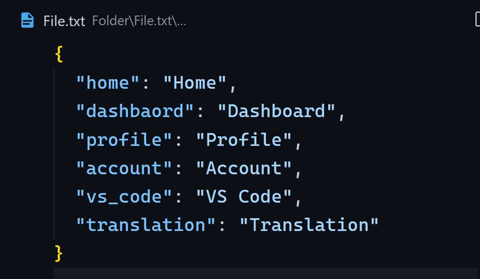

# Visual Studio Pseudo Localization

This extension let's you convert your string into Pseudolocalized strings for software internationalization testing. The english alphabets are converted into altered version of themselves but still readable.

---

## Demo

---

## How to use

1. select text in editor or multiple text
1. press `⇧⌘P` / `Ctrl+Shift+P`
1. search for `Convert to pseudolocalized string`

---

## Extension Settings

Currently, there are no settings, please let me know if you want any settings with this extetnsion in github issues.

---

## Release Notes

Users appreciate release notes as you update your extension.

### 1.0.0

Initial release of pseudo-localization

---

**Enjoy!**
